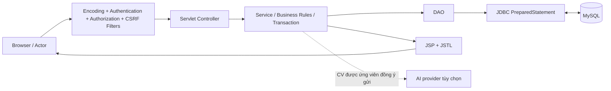
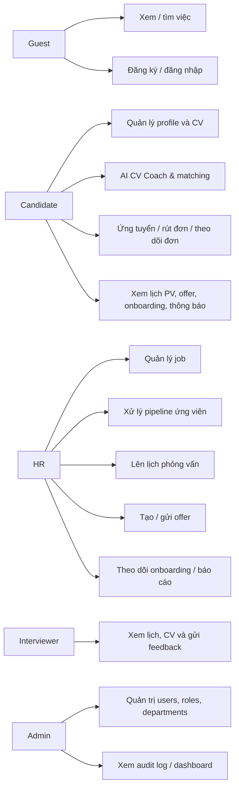
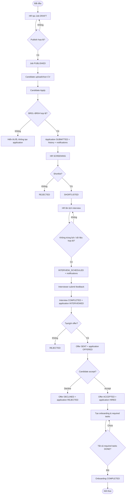
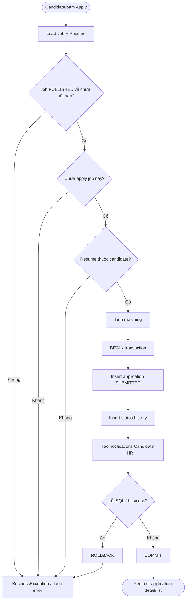
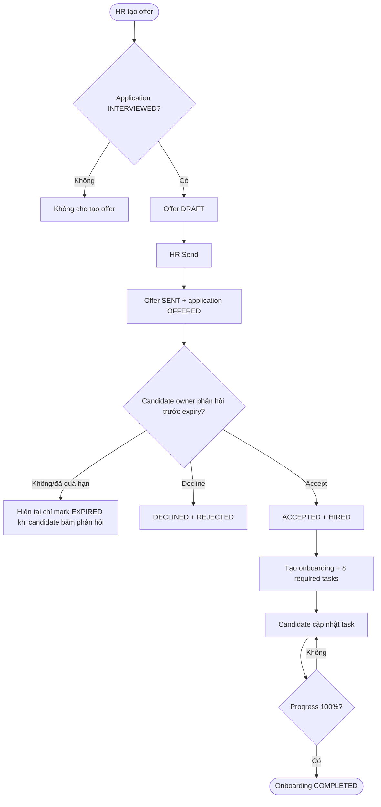
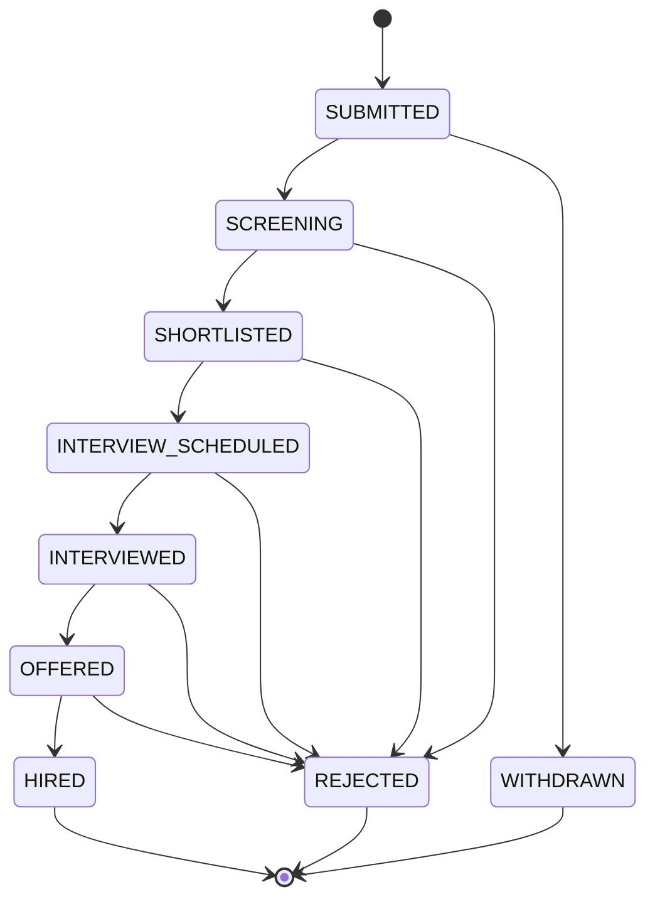

# Báo cáo BA/QA – RecruitFlow

> Phạm vi: baseline source được rà soát ngày 22/08/2026; trạng thái triển khai và xác minh runtime được cập nhật ngày 23/08/2026.
> Cách đánh giá hiện tại: đọc source, build Maven, chạy runner local, kiểm tra HTTP với Tomcat/MySQL và đối chiếu nghiệp vụ. Chưa thực hiện kiểm thử trực quan/thao tác bằng browser.

## 1. Kết luận nhanh

RecruitFlow là hệ thống quản lý tuyển dụng và onboarding theo mô hình web MVC. Luồng nghiệp vụ chính đã được thiết kế khá đầy đủ: **HR đăng tin → Candidate ứng tuyển → sàng lọc → phỏng vấn → feedback → offer → nhận việc → onboarding**.

- Có **5 actor nội bộ**: Guest, Candidate, HR, Interviewer, Admin.
- Nếu tính dịch vụ tích hợp tùy chọn thì có **6 actor**, actor thứ sáu là nhà cung cấp AI tương thích OpenAI Responses API.
- `npm run dev` đã chạy thành công với MySQL 8 và Tomcat 9, áp dụng migration đã duyệt, build/deploy WAR và phục vụ ứng dụng tại context `/recruitflow` (môi trường xác minh dùng cổng 8081).
- `mvn test` hiện chạy **12 regression tests, 0 failures / 0 errors**; package WAR cũng PASS.
- HTTP E2E đã PASS cho các trang public, kiểm soát session ở public GET (không tạo cookie session), taxonomy category, security headers, login redirect và RBAC của Admin/HR/Interviewer/Candidate. Candidate đăng nhập đúng được chuyển về `/home`.
- Các finding cốt lõi của baseline đã được sửa trong source: DB config/secret fallback, session stale, report filter, public job hết hạn, offer expiry, filter offer, inbox staff, audit pagination và policy Admin/Interviewer. Phần 10 được giữ lại như bằng chứng **baseline lịch sử**, không phải danh sách lỗi còn mở.
- Chưa có bằng chứng browser visual; các luồng tạo dữ liệu đầy đủ từ job đến onboarding, upload tệp thật, gửi OTP Gmail thật và callback Google OAuth thật vẫn cần test riêng.

> **Cập nhật triển khai 23/08/2026:** database config đã đồng bộ, session được revalidate theo `users.status`/role/session version, Candidate landing tại `/home`, recruiter public registration thành `HR/INACTIVE` chờ Admin kích hoạt, và đã thêm Gmail OTP (reset + login step-up) cùng Google OAuth Candidate tùy chọn. Xem `SETUP.md`, `QA_CORE_FIXES.md` và `ARCHITECTURE.md` để có trạng thái vận hành hiện tại.

## 2. Công nghệ đang dùng

| Lớp | Công nghệ / vai trò |
| --- | --- |
| Backend | Java 17, Servlet 4 (`javax.servlet`), JSP/JSTL |
| Kiến trúc | MVC phân lớp: Filter → Servlet Controller → Service → DAO → JDBC → MySQL |
| Database | MySQL 8, JDBC, `PreparedStatement`, transaction thủ công |
| Build / deploy | Maven, packaging WAR, Apache Tomcat 9 |
| Giao diện | HTML5, CSS3, JavaScript thuần, Bootstrap 5.3, Bootstrap Icons |
| Biểu đồ báo cáo | Chart.js 4.4 |
| Bảo mật | BCrypt, session revalidation, CSRF token, Gmail OTP tùy chọn, Google OAuth Candidate tùy chọn, filter Authentication/Authorization |
| Tệp CV | PDFBox (PDF), Apache POI (DOC/DOCX), upload tối đa 5 MB |
| AI tùy chọn | Java `HttpClient`, OpenAI-compatible Responses API; có fallback phân tích local |

Lưu ý deploy: code sử dụng `javax.servlet`, vì vậy cần **Tomcat 9**. Tomcat 10+ dùng `jakarta.servlet` và không chạy trực tiếp source này.

## 3. Kiến trúc và actor

| Actor | Mục tiêu chính | Quyền chính |
| --- | --- | --- |
| Guest | Tìm hiểu, tìm việc, tạo tài khoản | Xem home/job, tìm kiếm/lọc job, register/login |
| Candidate | Ứng tuyển và theo dõi hồ sơ | Profile, CV, matching, apply/rút đơn, lịch PV, offer, onboarding, thông báo |
| HR | Vận hành tuyển dụng | Job, pipeline ứng viên, lịch PV, offer, onboarding, báo cáo |
| Interviewer | Đánh giá ứng viên được phân công | Xem lịch/candidate CV, submit feedback |
| Admin | Quản trị hệ thống | User/role/status, department, danh mục nghề nghiệp, ma trận quyền, audit log, dashboard |
| AI provider (tùy chọn) | Đánh giá nội dung CV có consent | Chỉ nhận extracted text cho đúng lần review đã đồng ý |

## 4. Use case tổng quát

| Nhóm UC | Chức năng phân rã |
| --- | --- |
| UC-01 Public & Auth | Home, job list/detail, search/filter, register, login, logout |
| UC-02 Candidate profile & CV | Cập nhật profile, upload/download/delete CV, đặt CV mặc định, AI review |
| UC-03 Apply & application | Matching, apply, rút đơn, danh sách/chi tiết/timeline application |
| UC-04 Job management | Tạo, sửa, publish, close, archive và skill của job |
| UC-05 Pipeline | Tìm/lọc đơn, chuyển trạng thái, xem profile/CV ứng viên |
| UC-06 Interview | Tạo/đổi/hủy lịch, check conflict, candidate/interviewer xem lịch |
| UC-07 Feedback | Interviewer xem hồ sơ được gán, nhập điểm/nhận xét/khuyến nghị |
| UC-08 Offer | Tạo/sửa/gửi offer, candidate accept/decline |
| UC-09 Onboarding | Tạo checklist tự động, HR thêm task, candidate cập nhật task/progress |
| UC-10 Notification & dashboard | Notification candidate, dashboard theo role |
| UC-11 Reports | Dashboard tuyển dụng, lọc ngày, export CSV |
| UC-12 Administration | Users, role, status, departments, danh mục nghề nghiệp, ma trận quyền, audit logs |

## 5. Đặc tả use case theo chức năng

### UC-01 – Xem việc làm và xác thực tài khoản

- **Actor:** Guest; Candidate sau khi đăng nhập.
- **Route chính:** `/home`, `/jobs`, `/jobs/detail`, `/register`, `/login`, `/login/verify-otp`, `/forgot-password/*`, `/oauth/google/*`, `/logout`.
- **Tiền điều kiện:** Không có cho xem job. Register chỉ hợp lệ khi chưa đăng nhập.
- **Luồng chính:**
  1. Guest vào Home hoặc danh sách Job.
  2. Hệ thống trả các job `PUBLISHED`, có search theo từ khóa, phòng ban, địa điểm, loại hình và sort.
  3. Guest xem detail; nếu là Candidate thì có thể chuyển sang apply.
  4. Guest chọn Người tìm việc (active ngay) hoặc Nhà tuyển dụng (cung cấp thông tin tổ chức, chờ Admin kích hoạt).
  5. Hệ thống validate, BCrypt kiểm password; Candidate login đúng tạo session mới và redirect `/home`, các role khác vào workspace theo role. Nếu cấu hình bắt buộc OTP email thì phải xác minh code trước khi tạo session.
  6. Guest có thể dùng reset OTP Gmail hoặc Google OAuth (chỉ Candidate) khi admin đã cấu hình.
  7. Logout là POST, hủy session và quay về login/home.
- **Luồng ngoại lệ:** sai email/password, account LOCKED/INACTIVE, email trùng, password không hợp lệ, role sai URL trả 403.
- **Kết quả:** session giữ `userId`, `fullName`, `role`, timeout 30 phút.

### UC-02 – Candidate quản lý profile, CV, matching và AI CV Coach

- **Actor:** Candidate; AI provider là actor phụ tùy chọn.
- **Route chính:** `/candidate/profile`, `/candidate/resumes`, `/candidate/resumes/upload`, `/default`, `/delete`, `/download`, `/ai-review`.
- **Tiền điều kiện:** Candidate đã đăng nhập. CV phải thuộc candidate đó.
- **Luồng chính:**
  1. Candidate cập nhật profile: học vấn, kỹ năng, kinh nghiệm, tóm tắt.
  2. Upload PDF/DOC/DOCX tối đa 5 MB.
  3. Hệ thống validate MIME/extension/size, tạo tên file an toàn, trích xuất text và lưu metadata.
  4. CV đầu tiên thành mặc định; candidate có thể đổi CV default hoặc xóa CV chưa được dùng trong application.
  5. Candidate chọn CV và yêu cầu AI review.
  6. Nếu chưa có cấu hình AI ngoài thì Local CV Coach phân tích; nếu AI ngoài có cấu hình, nội dung chỉ được gửi sau khi Candidate consent cho lần đó. Lỗi AI ngoài fallback local.
- **Luồng ngoại lệ:** file sai loại/quá 5 MB, parse thất bại, CV không thuộc owner, CV đã được application tham chiếu không thể delete, consent chưa được tick.
- **Kết quả:** CV có `extracted_text`, có thể dùng tính match score; AI không sửa CV gốc.

### UC-03 – Ứng tuyển, rút đơn và theo dõi application

- **Actor:** Candidate; HR nhận notification khi có đơn mới.
- **Route chính:** `/candidate/jobs`, `/candidate/applications`, `/candidate/applications/detail`, `/candidate/applications/apply`, `/candidate/applications/withdraw`.
- **Tiền điều kiện:** Candidate đăng nhập, job `PUBLISHED` và chưa quá deadline, có CV của chính mình.
- **Luồng chính:**
  1. Candidate chọn job và CV (hoặc CV default), nhấn Apply.
  2. Hệ thống kiểm tra BR01–BR04: job tồn tại/published/chưa quá hạn, chưa apply trùng, CV thuộc owner.
  3. Tính weighted skill matching.
  4. Trong một transaction: tạo application `SUBMITTED`, thêm history, tạo notification cho Candidate và người tạo job.
  5. Candidate xem danh sách/chi tiết, match score, status history và interview/offer liên quan.
  6. Candidate chỉ có thể withdraw khi application còn `SUBMITTED`.
- **Luồng ngoại lệ:** apply trùng, CV không thuộc user, job closed/archived/quá hạn, chuyển trạng thái không hợp lệ.
- **Kết quả:** một candidate chỉ có một application cho một job do unique constraint `(job_id, candidate_id)`.

### UC-04 – HR quản lý job

- **Actor:** HR, Admin.
- **Route chính:** `/hr/jobs`, `/create`, `/edit`, `/update`, `/status`.
- **Tiền điều kiện:** User có role HR hoặc Admin; input hợp lệ.
- **Luồng chính:**
  1. HR tạo job cùng department, vị trí, salary, deadline, mô tả, yêu cầu và danh sách skills.
  2. Hệ thống validate và tạo `DRAFT` cùng `job_skills` trong transaction.
  3. HR sửa job draft/published theo rule.
  4. Chuyển trạng thái hợp lệ: `DRAFT → PUBLISHED/ARCHIVED`, `PUBLISHED → CLOSED/ARCHIVED`, `CLOSED → PUBLISHED/ARCHIVED`.
  5. Job có application không bị hard delete; chỉ archive.
- **Luồng ngoại lệ:** salary range sai, deadline quá khứ, skills trùng/trọng số ngoài 1–10, status transition sai, department không tồn tại.
- **Kết quả:** chỉ job `PUBLISHED` còn hạn mới được công khai và có thể apply; cả public query/detail lẫn transaction apply đều kiểm tra deadline.

### UC-05 – HR xử lý pipeline ứng viên

- **Actor:** HR, Admin.
- **Route chính:** `/hr/applications`, `/detail`, `/status`, `/hr/resumes/download`.
- **Tiền điều kiện:** HR/Admin đã login; application tồn tại.
- **Luồng chính:**
  1. HR search/filter application theo keyword, job, status, match score.
  2. Xem chi tiết candidate, CV, matching và lịch sử trạng thái.
  3. HR chuyển status theo state machine hoặc reject kèm remarks.
  4. Hệ thống ghi history và notification cho Candidate trong cùng transaction.
- **Luồng ngoại lệ:** application không tồn tại, actor không phải HR/Admin, nhảy status không hợp lệ, không được set `HIRED` thủ công.
- **Kết quả:** pipeline có audit timeline rõ ràng.

### UC-06 – Lên lịch, đổi lịch, hủy lịch phỏng vấn

- **Actor:** HR/Admin tạo lịch; Candidate/Interviewer nhận và xem lịch.
- **Route chính:** `/hr/interviews`, `/create`, `/edit`, `/update`, `/cancel`; `/candidate/interviews`; `/interviewer/interviews`.
- **Tiền điều kiện:** application `SHORTLISTED` (hoặc đã `INTERVIEW_SCHEDULED` để thêm vòng), interviewer ACTIVE, thời gian hợp lệ.
- **Luồng chính:**
  1. HR chọn shortlisted candidate, interviewer, hình thức, ngày/giờ và địa điểm/link.
  2. Hệ thống kiểm `start < end`, không ở quá khứ, online có meeting URL, interviewer không bị trùng lịch.
  3. Tạo interview `SCHEDULED`; nếu từ `SHORTLISTED`, chuyển application sang `INTERVIEW_SCHEDULED`.
  4. Tạo notification cho Candidate và Interviewer.
  5. HR có thể reschedule hoặc cancel interview chưa completed.
- **Luồng ngoại lệ:** interviewer conflict, application chưa shortlist, meeting URL thiếu, sửa/hủy interview completed.
- **Kết quả:** lịch có status `SCHEDULED`, `RESCHEDULED`, `CANCELLED`, `COMPLETED`.

### UC-07 – Interviewer đánh giá phỏng vấn

- **Actor:** Interviewer được gán.
- **Route chính:** `/interviewer/dashboard`, `/interviewer/interviews`, `/detail`, `/resumes/download`, `/interviews/feedback`.
- **Tiền điều kiện:** Interviewer đăng nhập và interview được assign đúng user; interview `SCHEDULED` hoặc `RESCHEDULED`.
- **Luồng chính:**
  1. Interviewer mở lịch của mình, xem profile/application và tải CV thuộc lịch được gán.
  2. Nhập technical, communication, experience, attitude (0–10), comment và recommendation.
  3. Hệ thống tính overall score trung bình.
  4. Trong một transaction: insert feedback, mark interview `COMPLETED`, application `INTERVIEWED`, ghi history và notification.
- **Luồng ngoại lệ:** interviewer khác truy cập ID, feedback đã tồn tại, interview canceled/completed, score ngoài phạm vi.
- **Kết quả:** HR có thể tạo offer cho application `INTERVIEWED`.

### UC-08 – Tạo, gửi và phản hồi offer

- **Actor:** HR/Admin tạo-gửi; Candidate phản hồi.
- **Route chính:** `/hr/offers`, `/create`, `/edit`, `/update`, `/send`; `/candidate/offers`, `/candidate/offers/respond`.
- **Tiền điều kiện:** tạo offer khi application `INTERVIEWED`; salary/start/expiry/location hợp lệ; chỉ một offer/application.
- **Luồng chính:**
  1. HR tạo offer ở `DRAFT`.
  2. HR sửa draft nếu cần.
  3. HR send: offer thành `SENT`, application `OFFERED`, Candidate nhận notification.
  4. Candidate owner accept hoặc decline trước expiry.
  5. Accept: offer `ACCEPTED`, application `HIRED`, tạo onboarding/task mặc định và gửi notification.
  6. Decline: offer `DECLINED`, application `REJECTED`, thông báo HR.
- **Luồng ngoại lệ:** application không `INTERVIEWED`, offer không DRAFT khi send, user phản hồi offer không thuộc mình, offer expired, offer đã phản hồi.
- **Kết quả:** nhận offer là điểm kích hoạt onboarding.

### UC-09 – Onboarding

- **Actor:** Candidate hoàn thành task; HR/Admin theo dõi và thêm task.
- **Route chính:** `/candidate/onboarding`, `/candidate/onboarding/tasks`; `/hr/onboarding`, `/hr/onboarding/tasks/create`.
- **Tiền điều kiện:** offer đã được accept, application `HIRED`, onboarding thuộc Candidate.
- **Luồng chính:**
  1. Accept offer tạo một onboarding `NOT_STARTED` cùng 8 required tasks mặc định.
  2. Candidate cập nhật task `TODO/IN_PROGRESS/DONE`.
  3. Hệ thống tính `progress = done required / total required × 100`.
  4. Onboarding chuyển `IN_PROGRESS` khi progress > 0; `COMPLETED` khi 100%.
  5. HR/Admin xem danh sách và thêm task required/optional.
- **Luồng ngoại lệ:** candidate sửa task không thuộc onboarding của mình, task/onboarding không tồn tại, HR không có quyền.
- **Kết quả:** onboarding độc nhất theo application.

### UC-10 – Notification và dashboard theo role

- **Actor:** Candidate; hệ thống tạo notification cho Candidate, HR, Interviewer.
- **Route chính:** `/candidate/notifications`, `/read`, `/read-all`; `/hr/notifications`, `/interviewer/notifications` và các route mark-read tương ứng; dashboard `/candidate/dashboard`, `/hr/dashboard`, `/interviewer/dashboard`, `/admin/dashboard`.
- **Tiền điều kiện:** User đúng role.
- **Luồng chính:**
  1. Apply, interview schedule, offer và onboarding tạo notification trong các transaction liên quan.
  2. Candidate xem danh sách notification, mark từng cái hoặc tất cả là read.
  3. Dashboard tổng hợp các chỉ số / danh sách việc theo role.
- **Luồng ngoại lệ:** notification không thuộc candidate sẽ bị từ chối.
- **Kết quả:** Candidate, HR và Interviewer đều có inbox riêng, chỉ owner được mark-read notification của mình.

### UC-11 – Báo cáo tuyển dụng và export CSV

- **Actor:** HR, Admin.
- **Route chính:** `/hr/reports`, `/hr/reports/export`.
- **Tiền điều kiện:** HR/Admin login; ngày lọc hợp lệ (`fromDate ≤ toDate`).
- **Luồng chính:**
  1. HR chọn từ ngày/đến ngày.
  2. Hệ thống tổng hợp application theo status, funnel, rates và theo tháng.
  3. HR download CSV của cùng report.
- **Luồng ngoại lệ:** ngày không hợp lệ/trái thứ tự.
- **Kết quả:** dashboard và CSV dùng cùng `fromDate/toDate`; metric `offersSent` áp dụng cùng cohort date range.

### UC-12 – Quản trị hệ thống

- **Actor:** Admin.
- **Route chính:** `/admin/users`, `/users/role`, `/users/status`, `/roles`, `/permissions`, `/job-categories`, `/departments`, `/departments/create`, `/update`, `/delete`, `/audit-logs`.
- **Tiền điều kiện:** Admin ACTIVE đã đăng nhập.
- **Luồng chính:**
  1. Admin xem dashboard và tìm/lọc users.
  2. Gán role, lock/unlock user (không được tự thay đổi chính mình).
  3. CRUD department, có kiểm tra trùng/tồn tại/liên kết FK.
  4. Quản lý danh mục nghề nghiệp hai cấp và ma trận quyền theo vai trò; các thay đổi được audit.
  5. Xem audit log của thay đổi user status/role/danh mục/quyền.
- **Luồng ngoại lệ:** actor không Admin, role/status/user/department không hợp lệ, xóa department đang được dùng.
- **Kết quả:** data quản trị được lưu; request tiếp theo của session bị lock/đổi role bị AuthenticationFilter revalidate và từ chối.

## 6. Biểu đồ hoạt động (activity diagrams)

### 6.1 Luồng E2E tuyển dụng đầy đủ

### 6.2 Hoạt động Apply và rollback

### 6.3 Hoạt động Offer → Onboarding

## 7. State machine nghiệp vụ

| Entity | State hợp lệ |
| --- | --- |
| Job | `DRAFT`, `PUBLISHED`, `CLOSED`, `ARCHIVED` |
| Application | `SUBMITTED`, `SCREENING`, `SHORTLISTED`, `INTERVIEW_SCHEDULED`, `INTERVIEWED`, `OFFERED`, `HIRED`, `REJECTED`, `WITHDRAWN` |
| Interview | `SCHEDULED`, `RESCHEDULED`, `COMPLETED`, `CANCELLED` |
| Offer | `DRAFT`, `SENT`, `ACCEPTED`, `DECLINED`, `EXPIRED` |
| Onboarding | `NOT_STARTED`, `IN_PROGRESS`, `COMPLETED` |
| Onboarding task | `TODO`, `IN_PROGRESS`, `DONE` |

## 8. Kịch bản E2E nghiệp vụ còn cần chạy bằng browser/DB

| Bước | Actor | Thao tác | Kỳ vọng dữ liệu / trạng thái |
| ---: | --- | --- | --- |
| 1 | HR | Login, tạo job hợp lệ | Job `DRAFT`, skills được lưu |
| 2 | HR | Publish job | Job `PUBLISHED`, xuất hiện public khi chưa quá hạn |
| 3 | Candidate | Login, tạo profile, upload CV | CV parse thành công, CV đầu tiên là default |
| 4 | Candidate | Apply job bằng CV | Application `SUBMITTED`, history + 2 notifications |
| 5 | Candidate | Apply lại cùng job | Bị từ chối, không có record trùng |
| 6 | HR | `SUBMITTED → SCREENING → SHORTLISTED` | Mỗi bước có history và notification |
| 7 | HR | Create interview hợp lệ | Interview `SCHEDULED`, application `INTERVIEW_SCHEDULED` |
| 8 | HR | Tạo lịch trùng interviewer | Bị từ chối, không tạo interview |
| 9 | Interviewer | Mở lịch được gán, submit feedback | Feedback có overall score, interview `COMPLETED`, application `INTERVIEWED` |
| 10 | Interviewer khác | Truy cập/feedback interview không thuộc mình | Bị từ chối/404/403 theo endpoint |
| 11 | HR | Create + send offer | Offer `SENT`, application `OFFERED`, Candidate có notification |
| 12 | Candidate | Accept offer trước expiry | Offer `ACCEPTED`, application `HIRED`, onboarding tạo cùng 8 task |
| 13 | Candidate | Complete toàn bộ required tasks | Progress 100%, onboarding `COMPLETED` |
| 14 | Admin | Lock HR đang login ở browser khác | Request kế tiếp của HR bị logout/chặn; không thể tiếp tục thao tác |
| 15 | HR | Lọc báo cáo ngày rồi export CSV | CSV trùng filter dashboard, gồm cả metric offer |

## 9. Kiểm thử hệ thống đã thực hiện

### 9.1 Môi trường thực tế đã xác minh (23/08/2026)

| Hạng mục | Kết quả |
| --- | --- |
| JDK / Maven | Java 17 và Maven 3.9.16 hoạt động; Maven dùng repository local được cấu hình cho runner. |
| MySQL | MySQL 8 (`MySQL80`) đang chạy và runner kết nối được database từ JDBC URL đã cấu hình. |
| Khởi động một lệnh | `npm run dev` PASS: kiểm tra/kết nối MySQL, chạy migration được duyệt, build WAR, deploy `recruitflow.war` và khởi động Tomcat 9. |
| Runtime | RecruitFlow phản hồi tại `/recruitflow`; môi trường xác minh dùng `http://localhost:8081/recruitflow/home`. |
| Secret local | Mật khẩu MySQL được nhập qua prompt bảo mật cho runner; `dev.config.json` chỉ chứa cấu hình không bí mật và bị Git ignore. |
| Browser visual | **NOT RUN**: chưa có kiểm thử ảnh chụp, responsive hoặc thao tác click/nhập liệu bằng browser. Evidence hiện tại là HTTP end-to-end smoke, không phải browser visual E2E. |

### 9.2 Kết quả build, regression và HTTP end-to-end smoke

| TC | Nội dung | Cách kiểm tra | Trạng thái | Evidence / kết quả |
| --- | --- | --- | --- | --- |
| T-01 | Maven regression | `mvn test` | PASS | **12 tests**, 0 failures, 0 errors. |
| T-02 | Đóng gói WAR | `mvn -DskipTests package` | PASS | Tạo WAR deployable thành công. |
| T-03 | Runner local | `npm run dev` | PASS | Migration được duyệt + build + deploy + Tomcat 9/MySQL chạy thành công. |
| T-04 | Public routes | HTTP GET `/home`, `/jobs`, `/login`, `/register`, `/forgot-password`, assets | PASS | Các route public chính trả 200; guest vào private route bị redirect về login. |
| T-05 | Public session và headers | HTTP response headers của public page | PASS | Public GET không tạo `JSESSIONID`; kiểm tra CSP, `X-Content-Type-Options`, `X-Frame-Options` và `Referrer-Policy` PASS. |
| T-06 | Login entry route | Login HTTP với account demo theo từng role | PASS | Admin → `/admin/dashboard`; HR → `/hr/dashboard`; Interviewer → `/interviewer/dashboard`; Candidate, gồm user Candidate mới, → `/home`. |
| T-07 | RBAC workspace/action | HTTP bằng session từng role | PASS | Admin được vào dashboard/category/permission; HR vào khu vực HR nhưng nhận 403 ở Admin; Interviewer vào khu vực của mình nhưng nhận 403 ở HR; Candidate vào home/dashboard/jobs/resumes nhưng nhận 403 ở Admin. |
| T-08 | Category hierarchy | HTTP `/home` và lọc `/jobs?categoryId=…` | PASS | Menu công khai hiển thị category cha/con từ DB; link lọc theo category hoạt động với taxonomy đã migrate. |
| T-09 | Regression security/unit | 12 test JUnit + source review | PASS một phần | Có regression cho auth session, rate limit, permission policy, CSRF filter, security headers và upload validation; không thay thế test mutation với DB thật. |
| T-10 | Full business mutation lifecycle | Browser/DB fixture | NOT RUN | Chưa chạy toàn bộ chuỗi tạo job → apply → interview → offer → onboarding trên dữ liệu test riêng. |
| T-11 | SMTP OTP và Google OAuth thật | Provider/callback thật | NOT RUN | Feature là tùy chọn, không có Gmail app password/OAuth client production để xác minh provider. |

**Ý nghĩa trạng thái:** `PASS` ở T-04 đến T-08 là HTTP end-to-end smoke trên Tomcat/MySQL thật. Nó xác nhận route, session, redirect, phân quyền và response header, nhưng không thay thế kiểm thử trực quan trên browser hoặc các thao tác POST thay đổi dữ liệu phức tạp.

### 9.3 Phạm vi còn cần xác minh

- Không có browser visual test, nên chưa kết luận về responsive, accessibility, JavaScript interaction hoặc rendering ở từng browser.
- Chưa tạo dữ liệu fixture để chạy đủ E2E mutation từ HR tạo job tới Candidate onboarding, bao gồm rollback/concurrency và quyền sở hữu record cụ thể.
- Chưa gửi email qua Gmail SMTP thật, chưa chạy Google OAuth với callback/provider thật và chưa xác minh production HTTPS/cookie `Secure`.
- Kiểm thử upload/download bằng tệp PDF/DOC/DOCX thật, CSV export có dữ liệu date range và lock/role ở hai browser session vẫn nên được chạy trước release production.

### 9.4 Checklist kiểm thử thủ công còn phải chạy

| ST | Kịch bản | Dữ liệu / thao tác chính | Kỳ vọng |
| --- | --- | --- | --- |
| ST-01 | Guest chỉ thấy job đang mở | Có DRAFT, CLOSED, ARCHIVED, PUBLISHED còn hạn và PUBLISHED quá hạn | Chỉ job PUBLISHED còn hạn được list/detail/apply |
| ST-02 | Authentication & role | Chưa login vào private URL; Candidate vào `/hr/*`; HR vào `/admin/*` | Redirect login hoặc 403 theo đúng policy |
| ST-03 | CSRF | POST có token đúng, thiếu token, token sai | Token đúng thành công; thiếu/sai nhận 403, không đổi data |
| ST-04 | CV upload | PDF/DOC/DOCX ≤5 MB; file sai loại; >5 MB; file không parse | Chỉ file hợp lệ lưu được; không để file/row mồ côi khi lỗi |
| ST-05 | Apply | CV default hợp lệ, không CV, CV user khác, apply lặp, job quá hạn | Chỉ case hợp lệ tạo 1 application/history/notifications |
| ST-06 | Pipeline status | Chuyển hợp lệ và thử `SUBMITTED → OFFERED` | Hợp lệ ghi history; nhảy bậc bị từ chối |
| ST-07 | Interview scheduling | Thời gian đúng, end ≤ start, online thiếu URL, interviewer trùng lịch | Chỉ lịch hợp lệ được tạo; conflict không tạo record |
| ST-08 | Interview feedback & ownership | Interviewer được gán/không được gán, submit lần 2 | Chỉ owner gửi 1 feedback; transaction cập nhật interview/application |
| ST-09 | Offer | Send draft, accept, decline, response quá expiry | State/history/notification/onboarding đúng theo nhánh |
| ST-10 | Onboarding | DONE đủ/thiếu required task, optional task | Progress chính xác; chỉ 100% required thì COMPLETED |
| ST-11 | Admin lock/role | Login ở hai browser, Admin lock hoặc đổi role user còn session | Request sau thay đổi phải bị chặn/re-authenticate |
| ST-12 | Reports/audit | Lọc ngày, export CSV, keyword user/action, pagination | UI/CSV/count/page cùng predicate và đúng label |

T-04 đến T-08 đã có HTTP smoke evidence, nhưng ST-01 đến ST-12 vẫn là checklist browser/DB mutation cần thực thi có chủ đích. Các mục chưa chạy là **NOT RUN**, không phải FAIL; không còn blocker vì thiếu Tomcat/deployed application.

## 10. Các lỗi baseline và trạng thái hiện tại

> Phần chi tiết F-01 đến F-09 bên dưới là evidence của snapshot ngày 22/08/2026. Các dòng `Actual` trong phần này mô tả **hành vi cũ**, không phải kết quả runtime 23/08/2026. Chúng được giữ lại để truy vết finding và cách tái hiện ban đầu.

| Finding baseline | Trạng thái source hiện tại | Còn cần xác minh |
| --- | --- | --- |
| F-01 DB config/secret | Đã sửa: cấu hình DB đồng bộ, không còn password fallback hard-code; runner được xác minh trên MySQL/Tomcat. | Fresh schema riêng nếu chuẩn bị môi trường mới. |
| F-02 Session stale | Đã sửa: revalidate status/role/session version ở request tiếp theo; có regression auth session. | ST-11 với hai browser session. |
| F-03 Report export | Đã sửa: export nhận date filter và dùng cùng report service. | ST-12 với dữ liệu date range thật. |
| F-04 Public job hết hạn | Đã sửa: public query/detail và apply đều kiểm deadline. | ST-01/ST-05 với job quá hạn thật. |
| F-05/F-06 Offer expiry/filter | Đã sửa: lazy normalization `EXPIRED`, reissue policy và điều kiện `<=`. | ST-09 với offer qua hạn. |
| F-07 Staff notification | Đã sửa: HR/Interviewer inbox + mark-read. | Luồng apply/schedule có notification thật. |
| F-08 Audit filter/pagination | Đã sửa: filter/count cùng predicate trước pagination. | ST-12 với nhiều trang dữ liệu. |
| F-09 Admin/Interviewer policy | Đã sửa: `/interviewer/*` chỉ thuộc Interviewer, phù hợp ownership. | Kiểm tra route cụ thể trong browser. |

### F-01 – Cấu hình database không nhất quán và có secret fallback hard-code

- **Mức độ:** P1 / High.
- **Evidence:** `schema.sql` tạo database `recruitflow`; README/ARCHITECTURE hướng dẫn `recruitflow` với default `root/root`; `DBUtil.java` lại fallback đến database `JobCVDB` và một password hard-code.
- **Cách tái hiện:**
  1. Làm đúng SETUP: chạy `schema.sql`, không set `RECRUITFLOW_DB_*` hay JVM properties.
  2. Deploy WAR.
  3. Mở một trang cần DB.
- **Expected:** App kết nối `recruitflow` vừa được schema tạo.
- **Actual:** Source cố kết nối `JobCVDB`; nếu DB đó không tồn tại/không cùng credential, ứng dụng lỗi kết nối hoặc dùng sai data.
- **Tác động:** Fresh setup/deploy dễ fail; secret trong source là rủi ro bảo mật.
- **Khuyến nghị:** Chọn duy nhất `recruitflow` hoặc một tên DB chính thức; bỏ password fallback; dùng env/JVM property/secret manager và fail-fast với message an toàn.

### F-02 – Lock user không vô hiệu session đang hoạt động

- **Mức độ:** P1 / High (security/authorization).
- **Evidence:** `AdminService.updateUserStatus` chỉ update database; `AuthenticationFilter` chỉ tin `userId`/`role` trong session. Login đặt session timeout 30 phút; nhiều service chỉ check role, không check `ACTIVE`.
- **Cách tái hiện:**
  1. Browser A: login bằng HR.
  2. Browser B: login Admin, lock tài khoản HR.
  3. Không refresh login ở Browser A, gọi `/hr/jobs` và tạo/sửa job.
- **Expected:** User locked bị logout hoặc mọi request kế tiếp bị 401/403.
- **Actual:** Browser A tiếp tục truy cập/tác động đến khi session hết hạn; role change cũng bị stale trong session.
- **Khuyến nghị:** Mỗi request private cần revalidate trạng thái/role nhẹ (cache ngắn), hoặc lưu `sessionVersion`/`lastInvalidatedAt`, invalidate toàn bộ session target sau lock/role update.

### F-03 – Export CSV báo cáo mất bộ lọc ngày

- **Mức độ:** P2 / Medium.
- **Evidence:** Form báo cáo gửi `fromDate/toDate`, nhưng link Export trong `hr/reports.jsp` là `/hr/reports/export` không query string. `HRReportExportController` chỉ lấy params từ request.
- **Cách tái hiện:**
  1. HR vào Reports, lọc từ `2026-07-01` đến `2026-07-31`.
  2. Xác nhận dashboard đã đổi dữ liệu.
  3. Nhấn “Xuất báo cáo”.
- **Expected:** CSV chỉ chứa cùng dữ liệu trong khoảng 01–31/07.
- **Actual:** Export không nhận date params, trả dữ liệu toàn bộ.
- **Ghi nhận liên quan:** chỉ số `offersSent` trên dashboard cũng đang gọi `OfferDAO.countByStatus` mà không nhận date filter, nên có thể vẫn là số toàn cục dù application metrics đã lọc.
- **Khuyến nghị:** Bind `fromDate` và `toDate` vào href hoặc biến nút Export thành submit theo cùng form/query; đưa date predicate vào toàn bộ metric, gồm `offersSent`.

### F-04 – Job quá hạn vẫn hiển thị và mở được ở public/candidate portal

- **Mức độ:** P2 / Medium (UX, dữ liệu không nhất quán).
- **Evidence:** `JobDAO.search`/`getPublishedJobById` chỉ filter `status=PUBLISHED`; `ApplicationService.apply` mới check deadline. Ngoài ra `JobService.changeStatus` không revalidate deadline, nên một job DRAFT đã quá hạn vẫn có thể bị publish bằng endpoint status.
- **Cách tái hiện:**
  1. Tạo job `DRAFT` có deadline hôm qua (bằng test data hoặc chờ deadline qua) rồi publish, hoặc chờ một job `PUBLISHED` qua deadline.
  2. Mở `/jobs` hoặc `/jobs/detail?id=...`.
  3. Candidate bấm Apply.
- **Expected:** Job quá hạn không hiện public hoặc hiển thị rõ “đã hết hạn” và không có nút apply.
- **Actual:** Job vẫn hiện/click được; đến Apply mới báo lỗi “đã hết hạn nộp hồ sơ”.
- **Khuyến nghị:** Thêm `j.deadline >= CURDATE()` vào public query/detail, hoặc có scheduled status close khi hết hạn.

### F-05 – Offer hết hạn không tự chuyển `EXPIRED`

- **Mức độ:** P2 / Medium.
- **Evidence:** `OfferService.respond` mới kiểm deadline và update `EXPIRED`; không có scheduler/background job/list-time normalization. Offer có unique per application.
- **Cách tái hiện:**
  1. Gửi offer có expiry date hôm nay.
  2. Không để Candidate phản hồi; chờ qua ngày hết hạn.
  3. Xem offer qua HR/Candidate.
- **Expected:** Offer tự thành `EXPIRED`; HR có thể follow-up/tạo offer mới theo chính sách.
- **Actual:** Offer có thể kẹt `SENT`, application kẹt `OFFERED`; unique offer/application cản tạo offer thay thế.
- **Khuyến nghị:** Scheduled job định kỳ expire offer, hoặc `expirePendingOffers()` trước khi list/create/send; định nghĩa rõ workflow replacement.

### F-06 – Filter “Hết hạn trước” của Offer dùng điều kiện bằng ngày

- **Mức độ:** P2 / Medium.
- **Evidence:** UI ghi “Hết hạn trước”, nhưng `OfferDAO.search` dùng `o.expiry_date = ?`, không phải `<= ?`.
- **Cách tái hiện:**
  1. Có offer hết hạn ngày 10/08 và 15/08.
  2. Filter “Hết hạn trước” = 15/08.
- **Expected:** Cả offer 10/08 và 15/08.
- **Actual:** Chỉ offer đúng ngày 15/08.
- **Khuyến nghị:** Đổi query thành `o.expiry_date <= ?`, hoặc đổi label thành “Hết hạn đúng ngày”.

### F-07 – Notification cho HR/Interviewer được tạo nhưng không có UI để đọc

- **Mức độ:** P2 / Medium.
- **Evidence:** `NotificationService` tạo notification cho người tạo job và interviewer; chỉ có `CandidateNotificationController`/JSP và route `/candidate/notifications`.
- **Cách tái hiện:**
  1. Candidate apply job hoặc HR schedule interviewer.
  2. Kiểm data notification của HR/interviewer.
  3. Login bằng HR/interviewer, tìm menu/route notification.
- **Expected:** Người nhận đọc được notification trong UI.
- **Actual:** Notification persist nhưng HR/Interviewer không có màn hình xem/mark read.
- **Khuyến nghị:** Tạo generic notification module theo role, hoặc chỉ tạo notification cho actor có UI nhận.

### F-08 – Audit log filter và pagination không đúng semantics

- **Mức độ:** P2 / Medium.
- **Evidence:** UI ghi “Người dùng / hành động”, nhưng service dùng input làm `action` exact, không search tên user/partial action. `fromDate` lọc sau pagination và `total` không theo date filter.
- **Cách tái hiện:**
  1. Có nhiều audit log ở nhiều ngày/page.
  2. Search theo tên người dùng hoặc action một phần; lọc `fromDate`.
  3. So số record/table/page total.
- **Expected:** Search đúng nhãn UI và total/page phản ánh toàn bộ filter.
- **Actual:** Tên user/partial action không match; date filter làm số lượng/trang sai.
- **Khuyến nghị:** Đưa keyword/date filter vào SQL trước `LIMIT/OFFSET`, count cùng predicate; đổi label nếu chỉ hỗ trợ exact action.

### F-09 – Chính sách Admin trên route interviewer không nhất quán

- **Mức độ:** P3 / Low-Medium.
- **Evidence:** `AuthorizationFilter` cho Admin vào `/interviewer/*`, nhưng controller/service bắt `interview.interviewerId == currentUserId`.
- **Cách tái hiện:**
  1. Login Admin.
  2. Mở `/interviewer/interviews` hoặc detail một interview được gán user khác.
- **Expected:** Hoặc Admin có quyền đọc theo policy URL, hoặc route phải trả 403 rõ ràng.
- **Actual:** Admin được qua filter nhưng danh sách không có interview gán cho mình/detail bị từ chối ownership.
- **Khuyến nghị:** Quyết định policy: bỏ Admin khỏi `/interviewer/*`, hoặc viết nhánh read-only admin rõ ràng.

## 11. Quan sát/rủi ro cần chốt với Product Owner

| ID | Quan sát | Câu hỏi cần chốt |
| --- | --- | --- |
| R-01 | **Đã xử lý:** Recruiter registration tạo `HR/INACTIVE` và lưu organization/job title/work phone | Admin review thông tin tại User management rồi bấm Kích hoạt; không còn tự nâng quyền HR công khai. |
| R-02 | AI provider cho phép cấu hình HTTP | Production có bắt buộc HTTPS để bảo vệ CV text không? Nên là có. |
| R-03 | Audit log đã bao phủ user status/role, danh mục và ma trận quyền; phạm vi department/job/offer cần chốt thêm | Audit bắt buộc bao phủ những action quản trị nào? |
| R-04 | CSRF hidden field được JS inject runtime | Có yêu cầu hỗ trợ browser tắt JS không? Nếu có, server-render token vào mọi POST form. |
| R-05 | Đã có 12 regression tests nhưng chưa có CI và vẫn có artifact `target`/crash log local | Có cần dọn repository và thiết lập pipeline build/test bắt buộc trước merge không? |

## 12. Khuyến nghị release sau xác minh runtime

### Đã đạt ở môi trường local

1. Runner một lệnh khởi động thành công Tomcat 9/MySQL, build/deploy WAR và migration có kiểm soát.
2. Có 12 regression tests chạy thực tế và HTTP smoke xác nhận public routes, login redirect, session/public response, category, security headers và RBAC bốn role.
3. Các finding F-01 đến F-09 của baseline đã được sửa trong source; trạng thái/khoảng trống test được ghi ở mục 10.

### Cần hoàn tất trước production sign-off

1. Chạy checklist ST-01 đến ST-12 với fixture DB riêng, đặc biệt apply/pipeline/interview/offer/onboarding, upload CV, report CSV và session lock ở hai browser.
2. Xác minh SMTP Gmail OTP, Google OAuth callback, HTTPS, cookie `Secure` và secret management trên môi trường gần production.
3. Sao lưu database trước migration; không dùng `schema.sql` để reset database đang có dữ liệu.
4. Thiết lập CI bắt buộc chạy Maven test/package và mở rộng DB integration/browser E2E trước merge/release.

### Nên cải thiện trong sprint kế tiếp

1. Bổ sung test integration cho transaction, concurrency, status transition, permission mutation và migration trên schema sạch.
2. Bổ sung browser visual/accessibility/responsive test; không suy ra chất lượng UI từ HTTP smoke.
3. Chốt phạm vi audit log cần bắt buộc và chính sách HTTPS/AI provider ở production.

### Bộ automation tối thiểu đề xuất

| Tầng | Test cần có |
| --- | --- |
| Unit | `ApplicationStatus`, matching, validation salary/deadline/score, report rate |
| Service + DB integration | apply rollback, duplicate apply, feedback transaction, offer accept tạo onboarding, status transitions |
| Servlet/security | login/session fixation, CSRF thiếu/sai token, role 403, lock session, ownership CV/offer/interview |
| Browser E2E | Core flow 15 bước ở mục 8, upload CV fixture, CSV export filter |

## 13. Tiêu chí nghiệm thu sau khi sửa

- **Đã đạt:** `mvn test` chạy 12 test thực tế; `npm run dev` chạy/deploy được trên Tomcat 9 + MySQL 8; HTTP smoke có log/evidence cho public, login redirect, category, header security và RBAC.
- **Đã sửa trong source:** session revalidation, public deadline, offer expiry/filter, report date filter, staff notification, audit pagination và policy Admin/Interviewer.
- **Còn điều kiện nghiệm thu:** chạy core business E2E với DB assertions, upload fixture, CSV có dữ liệu, multi-session lock/role và browser visual. Test provider Gmail/OAuth và HTTPS trước khi bật các tính năng đó ở production.
